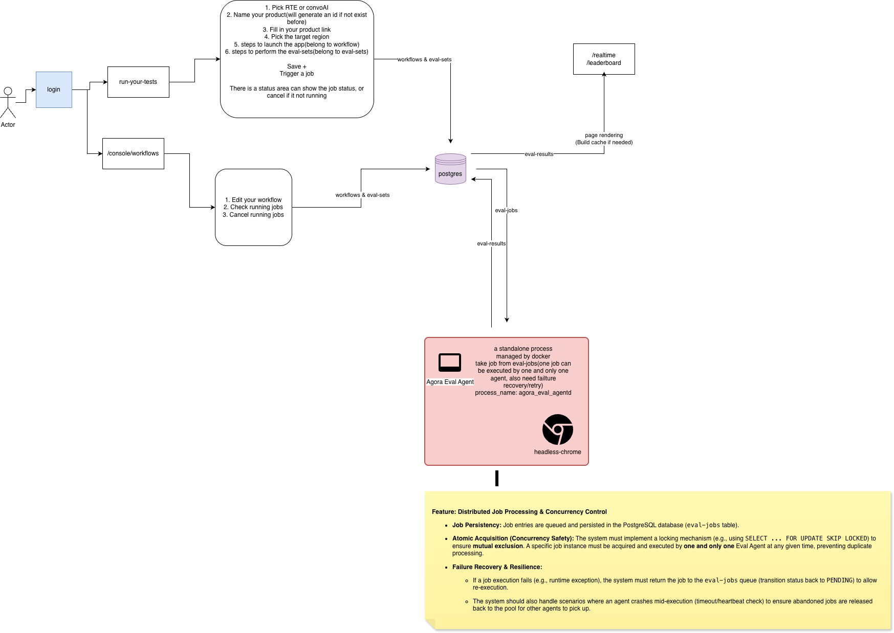

# Vox Implementation Plan - Remaining Phases


# Original Specs(HLD/LLD)

https://app.plane.so/eval/projects/ea574f7f-7d0c-4efe-8297-71d8bd89c2cd/pages/baf4f9d3-8f52-43db-94bb-6e69ebda1e1e/



Use the latest in following spec:


### Rules:

#### KISS(Keep it Simple and Stupid)

#### Ensure Security, keep all the api key/token and senstive data safe, even it is directly leaked from database, it can not be used directly.

#### Modularized and API-ready. Currently, it’s a web version, but in the future, it can easily be integrated via API into other platforms, such as CLI tools or even Android/iOS apps.


### User System:

#### User roles: `Basic` (regular, 0 cost), `Premium` (can create private workflow/eval-sets), `Principal` (Scout - can mark workflow as mainline, internal only), `Fellow`(almost same with `Principal` but with external prestige)

#### `isAdmin` flag for system management , Only `admin` can have this flag so far. `admin` can change the external users as `Fellow`(separate from pay plan), `admin` can approve the fund return(Right now for `Premium` users)

#### Scout user is created during system initialization along with `admin` (needs activation)

#### Support oauth, right now support Google, but can be extended to others

#### Support create orgnization later, and user can be binded to created orgnization

#### Orgnization can buy team `Premium` for users, listing price x seats x discount

#### Pricing: $5/mo per solo `Premium` seat, $6/mo per orglization `Premium` seat. seats <= 2: no discount, seats <= 5: 10% OFF, seats > 5 but <= 10: 15% OFF, seats > 10: 25% OFF per each transaction, not total seats under the orgnization. These should be configured to database(You name the table).

### VOX Eval Agent System:

#### `admin` creates eval agent tokens with region assignment, multiple worker agents for same region supported

#### Eval agents(This is a standalone process based on `voice-agent-tester`, process_name: vox_eval_agentd) register to the system using tokens

#### Eval agents fetch jobs matching their region

#### Eval agents execute eval sets using `voice-agent-tester` and report results back

#### Eval agents are visible to all users (Principal, Basic, Premium, Fello)

#### Eval agents are launched and managed by docker system

#### More information: npm start -- -a apps/livekit.yaml -s suites/appointment.yaml --headless false


### Data Model:

#### `providers` table storing: id(12-char randomized, immutable after born, even migrate to a new place or version), name(like Agora ConvoAI Engine, LiveKit Agents), sku(0 for ConvoAI Engine, 1 for RTC Engine)

#### `evalResults` table storing: response_latency(Median/Standard Deviation), interrupt_latency(Median/Standard Deviation), network_resilience, naturalness, noise_reduction

#### `workflows` and `evalSets` tables with visibility (public/private, default public) and isMainline flags

#### `evalSchedules` table (NEW) storing: workflowId, evalSetId, region, scheduleType(once/recurring), cronExpression, timezone, isEnabled, nextRunAt, lastRunAt, runCount, maxRuns, createdBy

#### `evalJobs` instance of the workflow and evalsets been executed, linked to scheduleId if created by scheduler

#### Results linked to workflow/evalSets via foreign keys

#### `evalAgents` table storing: region, createdTs, expiredTs, lastSeenTs, lastJobTs, state(IDLE/OFFLINE/OCCUPIED), token

#### `users` table storing: id(number), name, role, password(md5 and salted, if salt is a best way to keep password safe), username, isAdmin, createdTs, orgnization(0 for solo, org if with a valid orgId), activation token(can only be used once)

#### `apis` table storing: api key, name, usage, createdTs, expiredTs, createdBy(user)

#### `orgnizations` orgnize the users, name, address, verified

#### `payment_histories`

#### `payment_methods` Support stripe only so far, but can be extented to others

### Pages:

#### `/realtime` - Real-time dashboard with latency charts (Agora ConvoAI vs LiveKit Agent)

#### `/leaderboard` - Global rankings by provider/region

#### `/dive` - Dive in more providers, how this evaluation done, how to use integrate into your own product

#### `/login` - Regular users to login

#### `/activate/:token` - Activate users with the link provided

#### `/admin/login` - Admin user login, admin user do not need register, created at /setup

#### `/admin/console` - Admin users management(/admin/console/users) and system management and workers management(/admin/console/workers)

#### `/console/workflows` and /console/eval-sets - Workflow/eval sets management with mainline toggle for principals

#### `/run-your-own` - Self-eval page (currently simulated, not connected to actual workers), why put it as a standlone page, it is the entrace, it is VERY important, NEED to make it easily seen for everyone. If you run from here, need to pick your product/or create one if not exist


### Procedures:

#### Admin can manage the system(Create eval agent, need to deploy it mannualy so far, but we can try to do it with api automatically)

#### Basic/Premium/Principal/Fellow users can login in and run the eval tasks(Under default project, enable to change project name)

#### Basic/Premium/Principal/Fellow users create more projects(Basic users 5 projects at most, 10 workflows belong to each project at most)

#### Premium/Principal/Fellow users can mark the workflow as private

#### Premium can have 20 projects at most, 20 workflows belong to each project at most

#### Principal/Fellow users can mark the workflow as mainline

#### All users(including not loged in), can see realtime/leaderboard(only fetch mainline data) and other pages

#### Orgnization admin(first user who create orgnization, and can invite at most 3 users as admin), orgnization admin can buy more seats and invite users into org.

#### Orgnization admin can create more projects, project are something to help to orgnize workflows

#### Orgnization can have 100 projects at most. 20 workflows belong to each project at most.

#### Users under this orgnization can also 20 personal projects at most, 20 workflows belong to each project at most


# Identified by AI Coding Agent


## Current Status (Updated 2025-01-27)

### Database Schema (20 Tables)
All tables created and operational:
- **Core:** `organizations`, `users`, `providers`, `projects`
- **Workflows & Evaluation:** `workflows`, `evalSets`, `evalSchedules` (NEW), `evalJobs`, `evalResults`
- **Eval Agents:** `evalAgentTokens`, `evalAgents`
- **API & Security:** `apiKeys`, `activationTokens`, `inviteTokens`, `systemConfig`
- **Billing:** `pricingConfig`, `paymentMethods`, `paymentHistories`, `organizationSeats`, `fundReturnRequests`

### New: Eval Schedule System
The `evalSchedules` table supports one-time and recurring job scheduling:
- **Schedule Types:** `once` (one-time) and `recurring` (cron-based)
- **Cron Support:** Standard 5-field cron expressions (minute hour day month weekday)
- **Features:** Timezone support, max runs limit, automatic next run calculation
- **Background Worker:** Processes due schedules every minute
- **API Endpoints:** Full CRUD + run-now trigger

### Seed Data
- Admin user, Scout user (principal plan), default providers
- Scout's LiveKit mainline workflow with 8-hour recurring schedule
- Pricing tiers configured

### Test Coverage
- **api.test.ts:** 107 tests (auth, workflows, eval-sets, schedules, multi-region, concurrent claiming)
- **auth.test.ts:** 26 tests (password hashing, verification)
- **cron.test.ts:** 32 tests (cron parsing, validation)
- **Total:** 165+ tests passing

---

## Phase 2: Security Enhancements ✅ COMPLETE

### 2.1 Password Security ✅
- Passwords hashed with bcrypt (server/auth.ts)
- Salt is built into bcrypt algorithm

### 2.2 Token Security ✅
- All tokens hashed with SHA256 before storage (storage.ts:hashToken)
- Tokens affected: activation tokens, invite tokens, eval agent tokens, API keys

### 2.3 API Key Security ✅
- ✅ API key generation with prefix (`vox_live_xxxx...`)
- ✅ Store only hash in database, return raw key only once on creation
- ✅ API key authentication middleware (`authenticateApiKey`, `requireAuthOrApiKey`)
- ✅ Rate limiting implemented (100 req/15min general, 20 req/15min auth)
- ✅ Usage tracking (lastUsedAt field)

**Implemented in:**
- `server/routes.ts` - API key management endpoints
- `server/auth.ts` - API key authentication middleware
- `server/storage.ts` - API key CRUD methods

---

## Phase 3: OAuth Integration (Google) ✅ COMPLETE

### 3.1 Google OAuth Setup ✅
- ✅ Passport and passport-google-oauth20 installed
- ✅ Google OAuth configured (env vars: GOOGLE_CLIENT_ID, GOOGLE_CLIENT_SECRET)
- ✅ OAuth routes implemented:
  - `GET /api/auth/google` - Initiate OAuth flow
  - `GET /api/auth/google/callback` - Handle callback
  - `GET /api/auth/google/status` - Check if OAuth is enabled
- ✅ Account linking for existing email addresses
- ✅ New user creation for new Google accounts

**Implemented in:**
- `server/routes.ts` - OAuth routes
- `server/auth.ts` - Passport configuration
- `client/src/pages/login.tsx` - "Sign in with Google" button

---

## Phase 4: Organization System with Pricing

### 4.1 Organization Management
**Tasks:**
1. Create organization endpoint
2. First user becomes org admin automatically
3. Org admin can invite up to 3 additional admins
4. Org admin can invite regular members
5. Organization verification flow (manual by system admin)

**API Endpoints:**
- `POST /api/organizations` - Create organization
- `GET /api/organizations/:id` - Get organization details
- `PATCH /api/organizations/:id` - Update organization
- `POST /api/organizations/:id/invite` - Invite user to org
- `GET /api/organizations/:id/members` - List members
- `PATCH /api/organizations/:id/members/:userId` - Update member role

### 4.2 Seat Management & Pricing
**Pricing tiers (already in pricingConfig):**
- Solo Premium: $5/mo per seat
- Org Premium: $6/mo per seat
  - 1-2 seats: no discount
  - 3-5 seats: 10% OFF
  - 6-10 seats: 15% OFF
  - 11+ seats: 25% OFF

**Tasks:**
1. Calculate seat pricing with discounts
2. Implement seat purchase flow
3. Track used vs total seats
4. Enforce seat limits on user invitations

**API Endpoints:**
- `GET /api/organizations/:id/seats` - Get seat info
- `POST /api/organizations/:id/seats/purchase` - Purchase seats
- `GET /api/pricing` - Get pricing tiers

### 4.3 Stripe Integration
**Tasks:**
1. Install Stripe SDK
2. Create Stripe customer on org creation
3. Implement payment method management
4. Implement subscription/one-time payment flow
5. Handle webhooks for payment events
6. Record payment history

**API Endpoints:**
- `POST /api/payments/create-intent` - Create payment intent
- `POST /api/payments/methods` - Add payment method
- `GET /api/payments/methods` - List payment methods
- `DELETE /api/payments/methods/:id` - Remove payment method
- `POST /api/webhooks/stripe` - Stripe webhook handler

### 4.4 Fund Return Requests
**Tasks:**
1. Premium users can request fund returns
2. Admin reviews and approves/rejects
3. Track request status

**API Endpoints:**
- `POST /api/fund-returns` - Request fund return
- `GET /api/admin/fund-returns` - List requests (admin)
- `PATCH /api/admin/fund-returns/:id` - Approve/reject (admin)

**Files to modify:**
- `server/routes.ts` - Add all organization/payment routes
- `server/storage.ts` - Add organization/payment methods
- `client/src/pages/` - Add organization management pages

**Estimated effort:** 8-10 hours

---

## Phase 5: Eval Agent System with Concurrency Control ✅ COMPLETE

### 5.1 Atomic Job Acquisition ✅
- ✅ Implemented `SELECT ... FOR UPDATE SKIP LOCKED` for race-free job claiming
- ✅ Transaction support in storage layer (`claimEvalJob`, `claimNextAvailableJob`)
- ✅ Region validation - agents can only claim jobs from their assigned region
- ✅ Tested with concurrent job claiming tests

```sql
-- Implemented atomic job claim
BEGIN;
SELECT * FROM eval_jobs
WHERE status = 'pending' AND region = $1
ORDER BY priority DESC, created_at ASC
LIMIT 1
FOR UPDATE SKIP LOCKED;

UPDATE eval_jobs SET status = 'running', eval_agent_id = $2, started_at = NOW()
WHERE id = $selected_id;
COMMIT;
```

### 5.2 Failure Recovery & Resilience ✅
- ✅ Heartbeat endpoint (`POST /api/eval-agent/heartbeat`)
- ✅ Background worker releases stale jobs (5 min timeout)
- ✅ Jobs reset to "pending" with incremented retry_count
- ✅ Jobs marked as "failed" after max_retries (3) exceeded
- ✅ Agent state tracking (idle, occupied, offline)

**Background worker runs every minute:**
- `releaseStaleJobs()` - Reset stuck jobs
- `processScheduledJobs()` - Create jobs from due schedules

### 5.3 Job Priority & Scheduling ✅
- ✅ Priority queue (higher priority first, then FIFO)
- ✅ **NEW: Full scheduling system** with `evalSchedules` table
- ✅ One-time schedules (run once at specified time)
- ✅ Recurring schedules (cron expressions)
- ✅ Job cancellation support

**Schedule API Endpoints:**
- `GET /api/eval-schedules` - List schedules
- `GET /api/eval-schedules/:id` - Get schedule
- `POST /api/eval-schedules` - Create schedule
- `PATCH /api/eval-schedules/:id` - Update schedule
- `DELETE /api/eval-schedules/:id` - Delete schedule
- `POST /api/eval-schedules/:id/run-now` - Trigger immediate job

**Cron parser features (`server/cron.ts`):**
- Standard 5-field cron expressions
- Hourly, daily, weekly patterns
- Boundary handling (midnight, month-end, year-end)
- Validation with helpful error messages

**Implemented in:**
- `server/storage.ts` - Atomic claim, stale job release, schedule CRUD
- `server/routes.ts` - Job and schedule management endpoints
- `server/index.ts` - Background worker
- `server/cron.ts` - Cron expression parser

---

## Phase 6: Frontend Updates

### 6.1 Public Pages (No Auth Required)

#### /realtime - Real-time Dashboard
**Current:** Basic chart implementation
**Needed:**
- Live updates (polling or WebSocket)
- Provider comparison (Agora ConvoAI vs LiveKit Agent)
- Region filtering
- Time range selection

#### /leaderboard - Global Rankings
**Current:** Basic table
**Needed:**
- Sort by different metrics
- Region filtering
- Provider details on click
- Only show mainline data

#### /dive - Provider Deep Dive
**Current:** Basic provider guide
**Needed:**
- Detailed provider information
- How evaluations work
- Integration guides
- API documentation links

### 6.2 Run Your Own (/run-your-own) - IMPORTANT ENTRY POINT
**Current:** Simulated self-test
**Needed:**
1. Pick RTE or ConvoAI product type
2. Name your product (generates ID if new)
3. Fill in product link
4. Pick target region
5. Steps to launch app (workflow config)
6. Steps to perform eval-sets
7. Save + Trigger job
8. Status area showing job progress
9. Cancel option if not running

**This is the main user entry point - needs to be prominent and easy to use**

### 6.3 Console Pages (Auth Required)

#### /console/workflows
**Current:** Basic list
**Needed:**
- Create/edit/delete workflows
- Link to projects
- Visibility toggle (public/private for Premium+)
- Mainline toggle (Principal/Fellow only)
- Run workflow button
- View job history

#### /console/eval-sets
**Current:** Basic list (named test-sets)
**Needed:**
- Rename to eval-sets throughout
- Create/edit/delete eval sets
- Visibility and mainline toggles
- Link to workflows

#### /console/projects (NEW)
**Needed:**
- Project list with workflow counts
- Create/edit/delete projects
- Project limits enforcement:
  - Basic: 5 projects, 10 workflows each
  - Premium: 20 projects, 20 workflows each
  - Org: 100 projects, 20 workflows each

### 6.4 Admin Console (/admin/console)
**Current:** User management
**Needed:**
- Eval agent token management
- Eval agent monitoring
- Fund return request management
- System configuration
- Organization verification

### 6.5 Organization Pages (NEW)
**Needed:**
- /console/organization - Org dashboard
- /console/organization/members - Member management
- /console/organization/billing - Seat purchase, payment methods
- /console/organization/settings - Org settings

### 6.6 Component Updates
**Tasks:**
- Update console-layout.tsx with new navigation items
- Add organization context/provider
- Update auth status to include org info

**Files to create/modify:**
- `client/src/pages/console-projects.tsx` (NEW)
- `client/src/pages/console-organization.tsx` (NEW)
- `client/src/pages/console-organization-members.tsx` (NEW)
- `client/src/pages/console-organization-billing.tsx` (NEW)
- `client/src/pages/run-your-own.tsx` (MAJOR UPDATE - rename from self-test)
- `client/src/pages/dashboard.tsx` (UPDATE)
- `client/src/pages/leaderboard.tsx` (UPDATE)
- `client/src/pages/dive.tsx` (UPDATE - rename from provider)
- `client/src/pages/console-testsets.tsx` -> `console-evalsets.tsx` (RENAME)
- `client/src/components/console-layout.tsx` (UPDATE)
- `client/src/App.tsx` (UPDATE routes)

**Estimated effort:** 12-15 hours

---

## Phase 7: API Layer for External Integration ✅ COMPLETE

### 7.1 API Key Authentication ✅
- ✅ API key middleware (`authenticateApiKey`)
- ✅ Support both session and API key auth (`requireAuthOrApiKey`)
- ✅ Rate limiting (express-rate-limit)
- ✅ Usage tracking (lastUsedAt)

### 7.2 Public API Endpoints ✅
**All endpoints implemented in `server/routes-api-v1.ts`:**
```
# Workflows ✅
GET  /api/v1/workflows - List workflows
POST /api/v1/workflows - Create workflow
GET  /api/v1/workflows/:id - Get workflow
PUT  /api/v1/workflows/:id - Update workflow
DELETE /api/v1/workflows/:id - Delete workflow
POST /api/v1/workflows/:id/run - Run workflow

# Eval Sets ✅
GET  /api/v1/eval-sets - List eval sets
POST /api/v1/eval-sets - Create eval set
GET  /api/v1/eval-sets/:id - Get eval set

# Jobs ✅
GET  /api/v1/jobs - List jobs
GET  /api/v1/jobs/:id - Get job status
DELETE /api/v1/jobs/:id - Cancel job

# Results ✅
GET  /api/v1/results - List results
GET  /api/v1/results/:id - Get result details

# Projects ✅
GET  /api/v1/projects - List projects
POST /api/v1/projects - Create project

# User ✅
GET  /api/v1/user - Get current user info

# Metrics (public) ✅
GET  /api/v1/metrics/realtime - Real-time metrics
GET  /api/v1/metrics/leaderboard - Leaderboard
```

### 7.3 API Documentation
**Remaining tasks:**
- ⬜ Add OpenAPI/Swagger documentation
- ⬜ Generate API reference page
- ⬜ Add code examples for CLI/mobile integration

**Implemented in:**
- `server/routes-api-v1.ts` - All API v1 routes
- `server/auth.ts` - API key middleware

**Estimated remaining effort:** 2-3 hours (documentation only)

---

## Phase 8: Comprehensive Tests 🔄 IN PROGRESS

### 8.1 Unit Tests ✅ PARTIAL
**Implemented:**
- ✅ Auth utilities (`tests/auth.test.ts` - 26 tests)
  - Password hashing and verification
  - Special characters and unicode handling
  - Empty password handling
- ✅ Cron parsing (`tests/cron.test.ts` - 32 tests)
  - parseNextCronRun for all patterns
  - validateCronExpression
  - Boundary cases (midnight, month-end, year-end)

**Remaining:**
- ⬜ Storage layer functions
- ⬜ Pricing calculations

### 8.2 Integration Tests ✅ COMPLETE
**Implemented in `tests/api.test.ts` (107 tests):**
- ✅ Auth API (login, logout, status, Google OAuth status)
- ✅ Provider API (list providers)
- ✅ Project API (CRUD operations)
- ✅ Workflow API (CRUD, run, mainline toggle)
- ✅ Eval Set API (CRUD, mainline toggle)
- ✅ Eval Agent API (token management, registration, heartbeat, job claiming)
- ✅ Schedule API (CRUD, validation, one-time, recurring)
- ✅ API Key API (create, list, revoke, delete)
- ✅ Multi-region tests (token creation, agent registration, region filtering)
- ✅ Concurrent job claiming tests (atomic operation verification)
- ✅ API key permission tests (v1 API access, revocation)
- ✅ Mainline and leaderboard API tests
- ✅ Edge cases and error handling (404s, validation errors)

### 8.3 E2E Tests
**Remaining:**
- ⬜ User registration and login flow
- ⬜ Complete workflow execution with results
- ⬜ Organization creation and member management

**Current test files:**
- `tests/api.test.ts` - 107 integration tests
- `tests/auth.test.ts` - 26 unit tests
- `tests/cron.test.ts` - 32 unit tests
- **Total: 165 tests**

**Estimated remaining effort:** 3-4 hours (E2E tests only)

---

## Implementation Progress Summary

| Phase | Description | Status | Effort |
|-------|-------------|--------|--------|
| Phase 1 | Core System | ✅ Complete | - |
| Phase 2 | Security Enhancements | ✅ Complete | Done |
| Phase 3 | Google OAuth | ✅ Complete | Done |
| Phase 4 | Organization System | ⬜ Not Started | 8-10 hours |
| Phase 5 | Eval Agent Concurrency + Scheduling | ✅ Complete | Done |
| Phase 6 | Frontend Updates | ⬜ Not Started | 12-15 hours |
| Phase 7 | API Layer | ✅ Complete (docs pending) | 2-3 hours remaining |
| Phase 8 | Comprehensive Tests | 🔄 In Progress | 3-4 hours remaining |

### Completed Features
- ✅ Password security (bcrypt)
- ✅ Token security (SHA256 hashing)
- ✅ API key system with prefix (`vox_live_`)
- ✅ Google OAuth integration
- ✅ Atomic job claiming with row locking
- ✅ Background worker for stale jobs
- ✅ **Eval schedule system** (one-time & recurring with cron)
- ✅ Multi-region support with region validation
- ✅ Complete API v1 layer
- ✅ 165+ tests (unit + integration)

### Remaining Work
- ⬜ Organization system with Stripe payments (~8-10 hours)
- ⬜ Frontend updates (~12-15 hours)
- ⬜ API documentation (~2-3 hours)
- ⬜ E2E tests (~3-4 hours)

**Total Remaining: ~25-32 hours**

---

## Dependencies & Prerequisites

### Environment Variables Needed
```
# Existing
DATABASE_URL=postgresql://...
SESSION_SECRET=...
INIT_CODE=...

# New for OAuth
GOOGLE_CLIENT_ID=...
GOOGLE_CLIENT_SECRET=...
GOOGLE_CALLBACK_URL=...

# New for Stripe
STRIPE_SECRET_KEY=...
STRIPE_PUBLISHABLE_KEY=...
STRIPE_WEBHOOK_SECRET=...
```

### NPM Packages to Add
```json
{
  "passport": "^0.7.0",
  "passport-google-oauth20": "^2.0.0",
  "stripe": "^14.0.0",
  "express-rate-limit": "^7.0.0"
}
```

---

## Notes

1. **KISS Principle**: Keep implementations simple. Avoid over-engineering.

2. **Security First**: All tokens/keys hashed before storage. No sensitive data in logs.

3. **API-Ready**: All features accessible via API for future CLI/mobile integration.

4. **Modular Design**: Each phase can be deployed independently.

5. **Backward Compatible**: Existing functionality preserved during updates.
